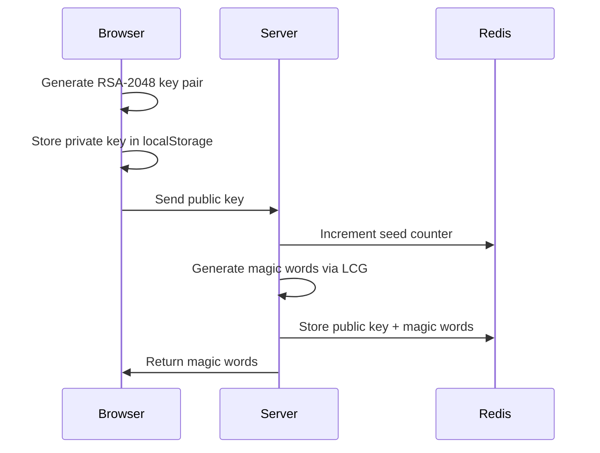
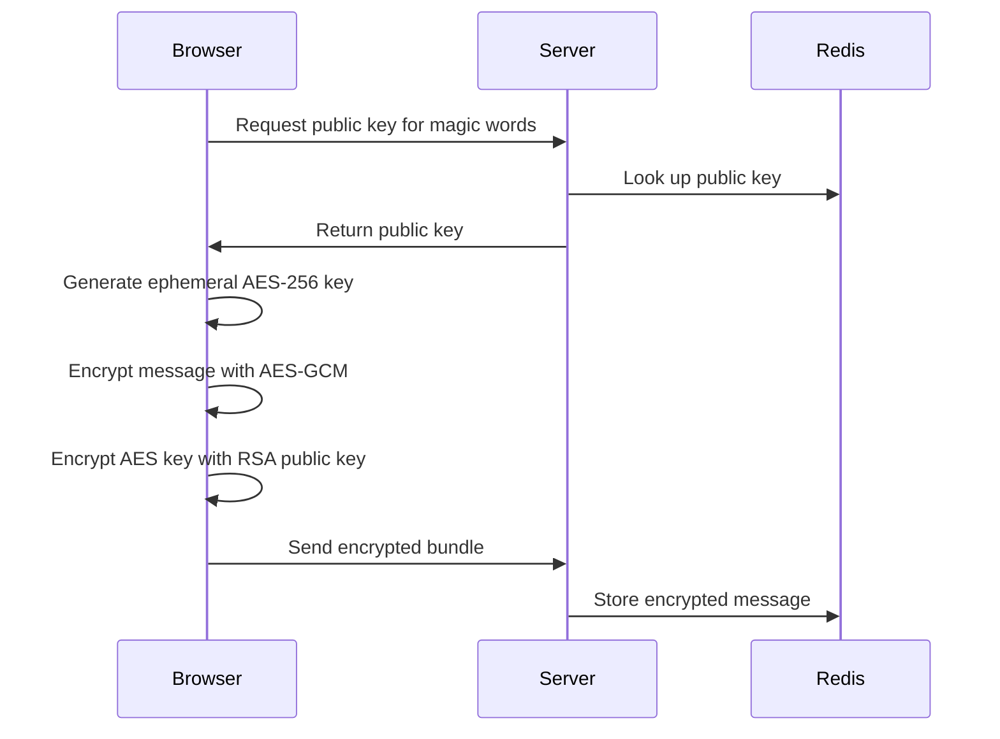
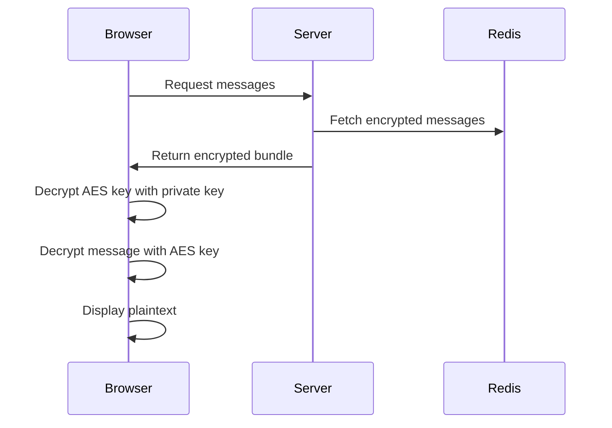

# MumbleKey

Secure, anonymous, disposable direct messaging using magic words.

## Overview

MumbleKey lets users exchange encrypted messages without accounts, emails, or any identifying information. Instead of usernames, recipients share a 2-word phrase (like `castle river`) that senders use to deliver encrypted messages.

All encryption happens in the browser using the Web Crypto API. Private keys never leave the user's device. The server only ever sees encrypted data it cannot read. All messages automatically expire after 7 days.

MumbleKey is a modern rebuild of [Whisper Key](https://github.com/pixielabs/whisper-key), originally built with Ruby on Rails by [Pixie Labs](https://github.com/pixielabs). This version was rebuilt to explore the Web Crypto API and Next.js Server Components.

**[Live Demo](https://mumble-key.vercel.app)** · **[Original Project](https://github.com/pixielabs/whisper-key)**

## How It Works

MumbleKey solves a simple problem: how do two people exchange encrypted messages without a complicated key exchange?

### The Magic Words Solution

Magic words are a human-friendly way to exchange public keys. When you want to receive messages:

1. Your browser generates an RSA key pair using the Web Crypto API
2. The private key stays in your browser (localStorage) — it never leaves
3. Your public key is sent to the server, which returns 2 memorable words
4. Share those words with anyone who wants to message you

When someone sends you a message, they enter your magic words, retrieve your public key, and encrypt their message. You decrypt it locally with your private key. The server only ever handles encrypted data it cannot read.

### Why RSA + AES?

RSA encryption is limited by key size — a 2048-bit key can only encrypt ~245 bytes directly. To support messages of any length, MumbleKey uses hybrid encryption:

- **AES-GCM (256-bit)** encrypts the actual message (fast, no size limit)
- **RSA-OAEP (2048-bit)** encrypts the AES key (secure key exchange)

Each message gets a fresh AES key, so even if one message were compromised, others remain secure.

### Magic Word Generation

Magic words are generated deterministically using a Linear Congruential Generator (LCG). The server maintains a counter; each new registration increments it and feeds the LCG, which selects 2 words from a curated word list. This keeps generation simple, stateless, and collision-resistant.

## Security Model

MumbleKey provides meaningful privacy guarantees, but it's important to understand what it does and doesn't protect against.

### What's Protected

- **End-to-end encryption** — Messages are encrypted in the sender's browser and decrypted in the recipient's browser. The server cannot read message contents.
- **No accounts or identity** — No emails, passwords, or personal information required. Magic words are the only identifier.
- **Private key isolation** — Private keys are generated and stored in the browser's localStorage. They are never transmitted to the server.
- **Ephemeral by design** — All data (keys, messages, sessions) automatically expires after 7 days.

### What's NOT Protected

- **No sender authentication** — Anyone with your magic words can send you a message. Messages could be spoofed.
- **No forward secrecy** — If a private key is compromised, all past messages encrypted to that key can be decrypted.
- **localStorage risks** — Private keys in localStorage can be accessed by malicious scripts (XSS) or anyone with physical access to the device.
- **Metadata visible to server** — The server knows when messages are sent and retrieved, and which magic words are involved.
- **No protection against a compromised server** — A malicious server could serve fake public keys to intercept messages.

**In short:** MumbleKey is designed for casual private communication — a step up from plaintext, but not the tool for transmitting nuclear codes.

## Tech Stack

| Layer | Technology |
|-------|------------|
| Framework | [Next.js](https://nextjs.org/) with App Router and Server Components |
| Encryption | [Web Crypto API](https://developer.mozilla.org/en-US/docs/Web/API/Web_Crypto_API) (RSA-OAEP, AES-GCM) |
| Database | [Upstash Redis](https://upstash.com/) (serverless, REST-based) |
| UI | [Chakra UI](https://chakra-ui.com/) |
| Deployment | [Vercel](https://vercel.com/) |

### Why These Choices?

- **Server Components** handle data fetching and Redis operations on the server, keeping API keys secure and reducing client bundle size.
- **Server Actions** (`"use server"`) provide type-safe RPC without building API routes.
- **Web Crypto API** is browser-native, audited, and avoids third-party crypto dependencies.
- **Upstash Redis** offers serverless Redis with a REST API, ideal for edge/serverless deployments with built-in TTL support for auto-expiration.

## Architecture

Detailed flow diagrams for those who want to understand the full request/response cycle.

### Receiving Flow

### Sending Flow

### Reading Flow

## License

MIT
